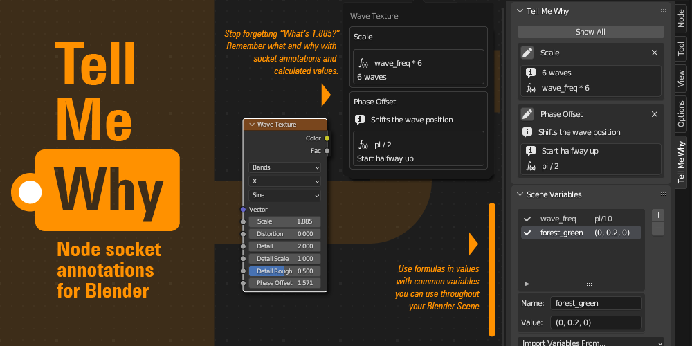

# Tell Me Why

https://github.com/SuperFLEB/blender_tell_me_why

A Blender addon that lets you show the math and take notes on your nodes, so you're never left wondering _exactly why_
you set the scale on that input to 1.885.

## Features

* Add descriptive annotations to node socket values
* See annotations in the Node Editor with a quick pop-out menu
* Use formulas that calculate socket default values
* Formulas and annotations are saved with the Blender file
* Scene-wide variables for use in formulas and values, and a global library (in Preferences) you can import to any file.

## To install

Either install the ZIP file from a release or clone this repository and use the build_release.py script to build a ZIP
that you can install into Blender.

## To use

### Annotations

Select a node in a node editor and open the N-panel (hit "N"), you'll find a new Tell Me Why tab in the N-panel.
Click a "+" to add annotations, and the pencil icon to edit them. You can add notes (text fields marked with the
"i" icon) or toggle the "f(x)" icon to use formulas or annotated values. The notes and values you enter are saved with
the file.

(If you'd rather have the Tell Me Why annotation panel in the Node tab. Just change the setting in the addon's
Preferences panel.) 

The addon also puts a button in the header bar of your node editors. If a node is annotated, it'll switch from
"No Annotations" to "Tell Me Why". Click for a quick-look overview of any notes or values on the node.

### Formulas

Formulas can include mathematical operators, functions, and variables. If the value of the node socket changes from
the formula, click the "Apply" button to re-run the formula and set the value, or use "File > Apply All Formulas" to
apply formulas everywhere in the file.

### Variables

Variables allow you to use the same named value in formulas throughout your Scene, without needing to remember exact
values each time or update multiple places if a common value changes. Variables can be found in the Tell Me Why panel,
and can be set to a number or a list (e.g., `(1, 2, 3)`). Their formulas can use built-in names and functions, but
cannot reference other variables.

*Please note: Variables exist on the Scene level, not the .blend-file level. (This is due to a limitation
in Blender that you can't attach data to the document as a whole, only a Scene.) You can easily copy all variables from
another Scene using the "Import Variables From..." feature, but it does need to be done manually.*

#### The Variable Library

If you've got variables you use often, you can put them in the Variable Library, in the addon's Preferences panel. These
are stored with your Blender preferences, and can be imported into any Scene. *Note that the Library is only for import,
and Library values must be imported to be used. Updates to the Library variables must be re-imported to be reflected in
files and scenes.*